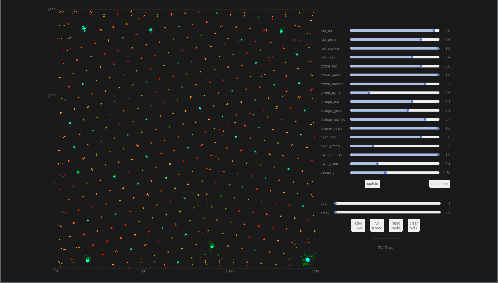

# ParticleLife.jl

Reimplementation of [particle-life](https://github.com/hunar4321/particle-life/tree/main)
in Julia, using `Agents.jl` and `Makie.jl`.

The code uses pretty straight-forward multi-threading for the velocity updates, and achieves >200fps for moderate number of particles (800 particles somewhat densely packed), including drawing, and about 30-40fps for 3000 particles.


https://github.com/RomeoV/ParticleLife.jl/assets/8644490/365676bb-3295-4676-8db4-074fc931346d


The tool allows for interaction with the rules on the fly.



## Usage
To use, install this package and also a Makie Backend -- presumably `GLMakie`. Then run `run_sim()`:
```julia
$ git clone https://github.com/RomeoV/ParticleLife.jl
$ cd ParticleLife.jl
$ julia --project=.
julia> ]instantiate
julia> ]add GLMakie
julia> using ParticleLife, GLMakie
julia> run_sim()
```
